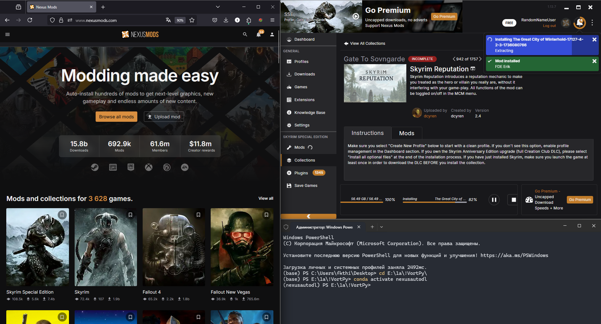

# StateMachineNexusAutoDL
This is a state machine version of [NexusAutoDL](https://github.com/jaylann/NexusAutoDL), designed for automating the process of downloading mods from [Nexusmods](https://www.nexusmods.com/), without being a premium member
Literally the same functionality, but a little more robust. It also auto-closes browser tabs (at least, it really tries to) so you don't need to manually close them or have 9000GB+ of RAM. However, it requires some specific setup for better clicking accuracy

# With this script
You can start downloading a 9999+ mods collection at night and simply go to sleep - it should be done by tomorrow. You need to check if it works first ofc, and, if you are not sure if this piece of code has some potential threat to your PC, read the source code (sorry for the zero readability)

The main purpose of rewriting [NexusAutoDL](https://github.com/jaylann/NexusAutoDL) and not using similar projects on GitHub/somewhere else is the really low accuracy of existing projects. 1 - Most of them are based on SIFT. It's overkill for finding buttons; they will never be rotated, even in 2D, so they just lead to false positives. A lot. 2 - They just scan for all known buttons every time. It also leads to false positives. With a state machine and the much simpler and robust `cv2.matchTemplate`, these main issues are gone. Also, it will close browser tabs keeping 2 open tabs in RAM - not all 9999+ tabs. The next step would be to use a full AI agent-based solution, but if you can afford THAT, then just go buy a Nexus subscription. It's really not worth any of it

# Prerequisites
Windows 10+, should run on any potato
Miniconda/anaconda of any version if running from source file

# Setup
First, open your vortex, make the window as small as possible, and move it at the top\bottom left\right corner as you like. Then, if you want to see a terminal, move it under the vortex window.
And finally, open the browser you are going to use, and move it to the side of your desktop. It should look just like this



Then, you can close the browser. The script will open a new browser window, the purpose of opening it manually is for remembering the browser position

The basic button templates assume that you have a classic vortex theme, and a standard nexusmods dark theme (idk if they even have a white theme). If you are using a different vortex theme or a browser extension in a browser that changes colors, set it as described or go to the `assets` folder and replace the existing image with your own screenshots.
Note, this script compares image RGB (actually brg but it doesnt matter at all) values and it will not convert them to grayscale. This is done due to the minimization of false positives. If something is not working as expected, adjust parameters as described under Adjusting parameters.

# Running the Script

## Using prebuild exe

Just grab rar file from [releases](https://github.com/Mimocro/SMNexusAutoDL/releases) and unpack it (make sure that the assets folder is next to the exe)

- With cmd
`smnexusautodl.exe <arguments>`
- With powershell
`./smnexusautodl.exe <arguments>`
- Command for running with firefox and Vortex
`./smnexusautodl.exe --browser firefox --vortex  --verbose `


## Running source code

Create and activate conda env

`conda create --name nexusautodl  -c conda-forge python=3.9`
`conda activate nexusautodl`

Clone this repository:

`git clone https://github.com/Mimocro/SMNexusAutoDL`

Or manually download the repository.

Then go into the directory you cloned/downloaded to.

`cd SMNexusAutoDL`

Install all necessary packages.

`pip install -r requirements.txt`

Run python script with or without arguments.

Windows:
`python main.py <arguments>`

A basic command that you can copypaste if you are using firefox and vortex:
`python main.py --browser firefox --vortex  --verbose `


# Command Line Options
```
--browser <browserName>: selects browser to open and move to work with Vortex. Can only be used in combination with `--vortex`. Currently supported browsers: “chrome”, “firefox” and "edge" (limited and untested)
--vortex: specifies use with Vortex mod manager: i have not tested it with any other mod manager, but it should work i think
--verbose: prints verbose output
--force-primary: forces a system with multiple monitors to only be scanned on it’s primary display
--vortex-dl-match-threshold <float>: Match threshold for Vortex download button (default: 0.9)
--vortex-cont-match-threshold <float>: Match threshold for Vortex continue button (default: 0.9)
--web-dl-match-threshold <float>: Match threshold for web download button (default: 0.8)
--click-here-match-threshold <float>: Match threshold for "click here" button (default: 0.9)
--understood-match-threshold <float>: Match threshold for "understood" button (default: 0.9)
--staging-match-threshold <float>: Match threshold for staging button (default: 0.9)
--wait-timeout-vortex <seconds>: Timeout (s) for Vortex-related waits (default: 7.0)
--wait-timeout-web <seconds>: Timeout (s) for web-related waits (default: 4.0)
--wait-timeout-click-here <seconds>: Timeout (s) for "click here" waits (default: 6.0)
--scan-interval-vortex <seconds>: Scan interval (s) for Vortex actions (default: 0.2)
--scan-interval-web <seconds>: Scan interval (s) for web actions (default: 0.5)
--scan-interval-click-here <seconds>: Scan interval (s) for "click here" actions (default: 0.5)
--post-click-delay <seconds>: Delay (s) after click before restarting scan (default: 2.0)
```

# Adjusting parameters
If the script makes too many false positive clicks or is not clicking at all, you can change
1) Images under the assets folder:
- Make and crop a screenshot of the button that the script fails to click
- Replace the file in the `assets` folder with your own screenshots. There are some notes from the source code
```BUTTON_ASSETS = {
    "vortex_dl": ["VortexDownloadButton.png", "VortexDownloadButton2.png", "VortexDownloadButton3.png"], #vortex download button
    "web_dl": ["WebsiteDownloadButton.png", "WebsiteDownloadButton2.png", "WebsiteDownloadButton3.png"], #slow download button in nexus site
    "click_here": ["ClickHereButton.png", "ClickHereButton2.png", "ClickHereButton3.png"], #click here button in nexus site (just for sure)
    "vortex_cont": ["VortexContinueButton.png", "VortexContinueButton2.png", "VortexContinueButton3.png"], #continue button for a case when vortex asks if it ned to redownload mod
    "understood": ["UnderstoodButton.png", "UnderstoodButton2.png", "UnderstoodButton3.png"], 
    "staging": ["StagingButton.png", "StagingButton2.png", "StagingButton3.png"]
}
```


2) Change THRESHOLD values:
- See Command Line Options.
- Increase/decrease the values of the specific buttons based on the accuracy of the script.
- For example, if there are too many false positive clicks with the download button at vortex, decrease to something like `--vortex-dl-match-threshold 0.95`. In reverse, if it fails to find this button, decrease it to `--vortex-dl-match-threshold 0.8` or lower - or try to make your own screenshot as described earlier.

3) Change timeouts
- My setup is an ssd and not that bad a cpu, with 300 mb\sec (yeah) internet. It opens the browser tab in like 1 second. If the script works too chaotically, adjust the timeouts (increase them). If you have a NASA pc, and you want faster speed, mess with these values and it will be ~2 times faster or so. 

# Demo

https://github.com/user-attachments/assets/f19c5208-d0aa-4462-b180-3efb85a66259


# Credit
Credit goes to [NexusAutoDL](https://github.com/jaylann/NexusAutoDL) for being a solid base for this project.

# Disclaimer
Nexusmods TOS state that using an automated program to download mods is prohibited. By using this software you are doing so at your own risk. The Author is not responsible for any kind of consequences and damages that might occur by using this program.
Also, if it somehow decides to delete the Windows or System32 folder, perhaps, this is the only fate